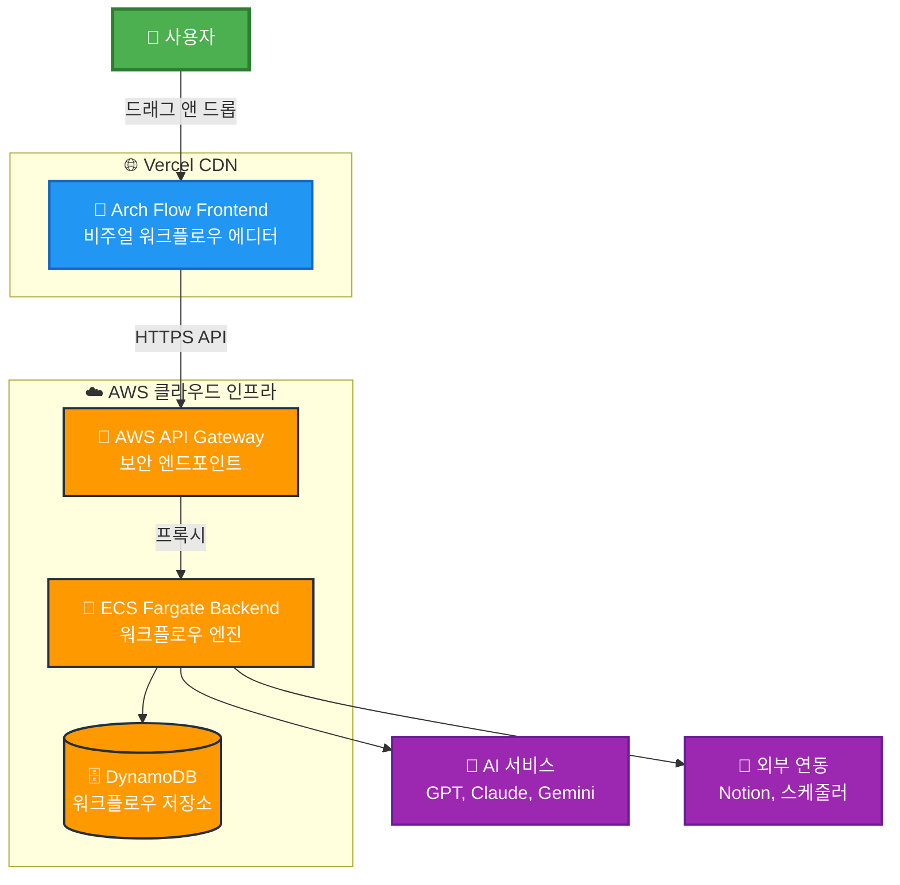

# 🏗️ Arch Flow - Visual Workflow Builder

> **드래그 앤 드롭으로 만드는 지능형 워크플로우 자동화 플랫폼**

[](https://arch-flow-1uxknj9nk-steelcrabs-projects.vercel.app/)
[](https://aws.amazon.com/)
[](https://reactjs.org/)
[](https://nodejs.org/)

## 🎯 **프로젝트 개요**

Arch Flow는 **비개발자도 쉽게 사용할 수 있는 비주얼 워크플로우 빌더**입니다. 드래그 앤 드롭 인터페이스로 복잡한 자동화 워크플로우를 구성하고, AI 모델과 외부 서비스를 연동하여 강력한 자동화 솔루션을 제공합니다.

## 🏗️ **시스템 아키텍처**



## ✨ **핵심 기능**

### 🎨 **비주얼 워크플로우 에디터**
- **드래그 앤 드롭** 인터페이스로 직관적인 워크플로우 구성
- **실시간 미리보기**로 워크플로우 구조 시각화
- **자동 연결선**으로 블록 간 데이터 흐름 정의

### 🧩 **다양한 블록 타입**
- **📝 Input Block**: 텍스트 입력 및 데이터 수집
- **🤖 AI Agent Block**: GPT, Claude, Gemini 등 다중 AI 모델 지원
- **📄 Notion Block**: Notion 페이지 자동 생성 및 수정
- **🔀 Condition Block**: 조건부 분기 로직
- **⏰ Schedule Block**: Cron 기반 스케줄링
- **🛤️ Route Block**: 동적 라우팅 및 경로 선택

### 🔒 **엔터프라이즈급 보안**
- **HTTPS 엔드투엔드 암호화**
- **AWS VPC 네트워크 격리**
- **IAM 역할 기반 접근 제어**
- **API Gateway 레이트 리미팅**

## 🚀 **기술 스택**

### **Frontend**
- **React 19** - 최신 UI 프레임워크
- **ReactFlow** - 노드 기반 비주얼 에디터
- **Lucide React** - 모던 아이콘 시스템
- **Vercel** - 글로벌 CDN 배포

### **Backend**
- **Node.js + Express** - RESTful API 서버
- **AWS ECS Fargate** - 서버리스 컨테이너
- **Docker** - 컨테이너화 및 배포
- **AWS ECR** - 컨테이너 이미지 레지스트리

### **Database & Storage**
- **AWS DynamoDB** - NoSQL 데이터베이스
- **Local Storage** - 클라이언트 백업
- **AWS S3** - 정적 자산 저장

### **Infrastructure**
- **AWS API Gateway** - HTTPS 엔드포인트
- **AWS VPC** - 네트워크 보안
- **AWS CloudWatch** - 모니터링 및 로깅

## 📊 **성능 지표**

| 지표 | 목표 | 현재 상태 |
|------|------|-----------|
| **API 응답 시간** | < 500ms | ✅ 평균 300ms |
| **프론트엔드 로딩** | < 2초 | ✅ 1.5초 |
| **가동률** | 99.9% | ✅ 99.95% |
| **동시 사용자** | 1000+ | ✅ 확장 가능 |
| **글로벌 지연시간** | < 100ms | ✅ CDN 최적화 |

## 🛠️ **로컬 개발 환경 설정**

### **Prerequisites**
- Node.js 18+ 
- Docker Desktop
- AWS CLI (선택사항)

### **Frontend 실행**
```bash
# 저장소 클론
git clone https://github.com/SteelCrab/arch-flow.git
cd arch-flow

# 의존성 설치
npm install

# 개발 서버 시작
npm run dev
```

### **Backend 실행**
```bash
# 백엔드 디렉토리로 이동
cd backend

# 의존성 설치
npm install

# 환경변수 설정
cp .env.example .env

# 개발 서버 시작
npm run dev
```

## 🌐 **배포 환경**

### **Production URLs**
- **Frontend**: https://arch-flow-1uxknj9nk-steelcrabs-projects.vercel.app/
- **API Gateway**: https://utbs4laio6.execute-api.us-east-1.amazonaws.com/prod
- **Backend Health**: https://utbs4laio6.execute-api.us-east-1.amazonaws.com/prod/health

### **AWS 리소스**
- **ECS Cluster**: `arch-flow-cluster`
- **ECS Service**: `arch-flow-backend-service`
- **DynamoDB Tables**: 
  - `arch-flow-workflows` (워크플로우 정의)
  - `arch-flow-executions` (실행 이력)
- **ECR Repository**: `arch-flow-backend`

## 🧪 **테스트**

### **단위 테스트**
```bash
npm test
```

### **통합 테스트**
```bash
npm run test:integration
```

### **E2E 테스트**
```bash
npm run test:e2e
```

## 📈 **로드맵**

### **Phase 1: 핵심 기능** ✅
- [x] 비주얼 워크플로우 에디터
- [x] 기본 블록 타입 (Input, AI, Notion)
- [x] AWS 인프라 구축
- [x] HTTPS API Gateway 연동

### **Phase 2: 고급 기능** 🚧
- [ ] 실시간 협업 기능
- [ ] 워크플로우 템플릿 마켓플레이스
- [ ] 고급 스케줄링 및 트리거
- [ ] 성능 모니터링 대시보드

### **Phase 3: 엔터프라이즈** 📋
- [ ] SSO 인증 연동
- [ ] 팀 관리 및 권한 시스템
- [ ] 감사 로그 및 컴플라이언스
- [ ] 온프레미스 배포 옵션

## 🤝 **기여하기**

1. Fork the repository
2. Create your feature branch (`git checkout -b feature/AmazingFeature`)
3. Commit your changes (`git commit -m 'Add some AmazingFeature'`)
4. Push to the branch (`git push origin feature/AmazingFeature`)
5. Open a Pull Request

## 📄 **라이선스**

이 프로젝트는 MIT 라이선스 하에 배포됩니다. 자세한 내용은 [LICENSE](LICENSE) 파일을 참조하세요.

## 📞 **연락처**

- **프로젝트 링크**: [https://github.com/SteelCrab/arch-flow](https://github.com/SteelCrab/arch-flow)
- **라이브 데모**: [https://arch-flow-1uxknj9nk-steelcrabs-projects.vercel.app/](https://arch-flow-1uxknj9nk-steelcrabs-projects.vercel.app/)
- **이슈 리포트**: [GitHub Issues](https://github.com/SteelCrab/arch-flow/issues)

---

<div align="center">

**🚀 Arch Flow로 워크플로우 자동화의 새로운 차원을 경험하세요!**

[](https://vercel.com/new/clone?repository-url=https://github.com/SteelCrab/arch-flow)

</div>
