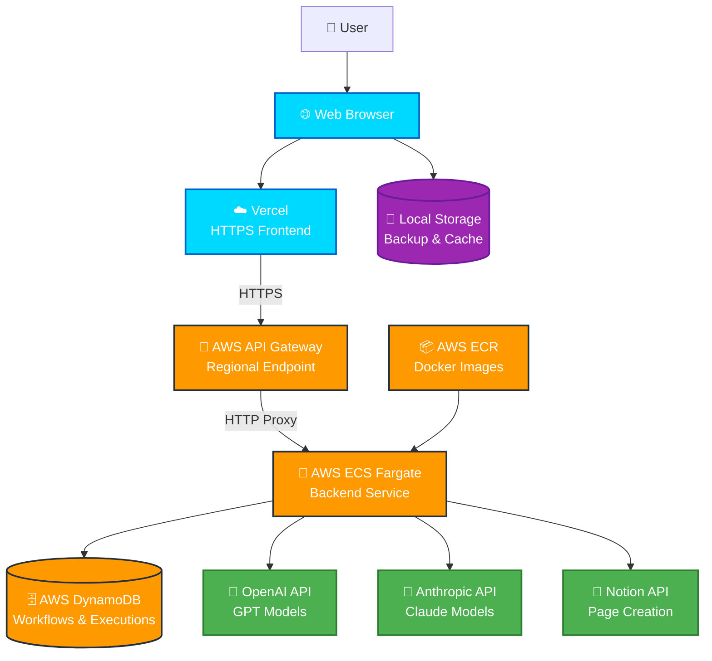
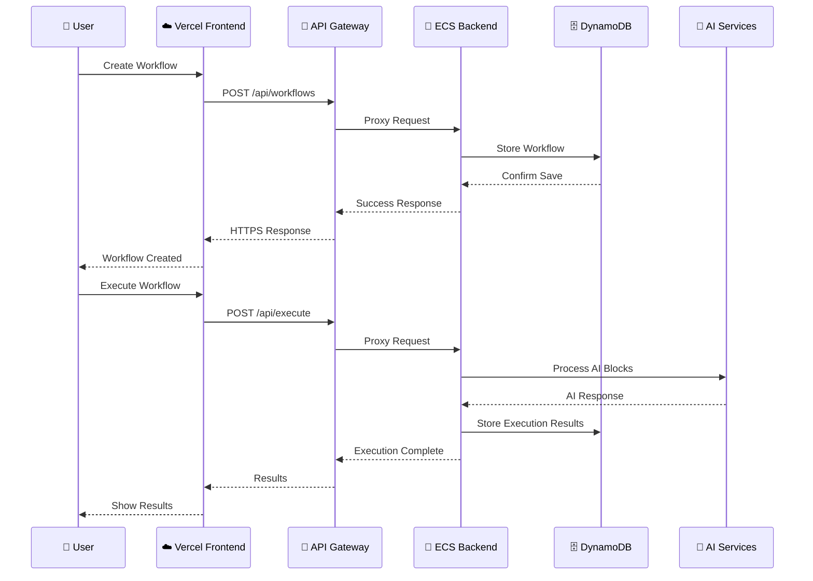
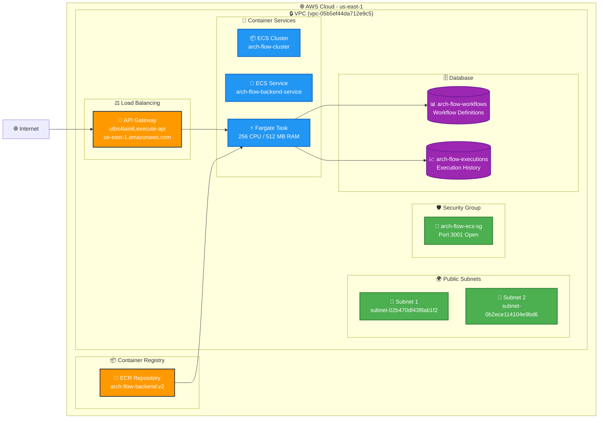
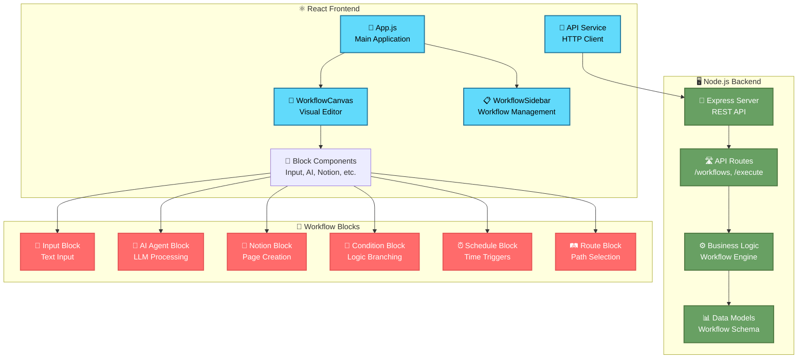
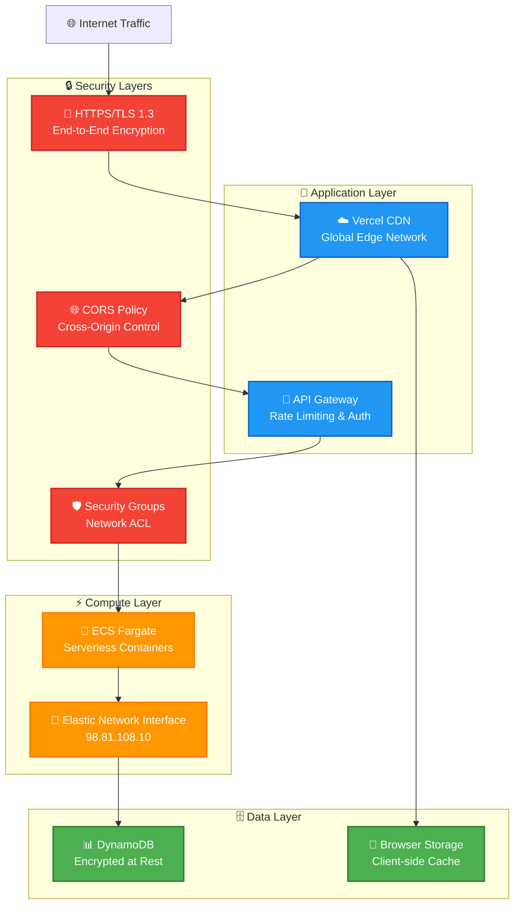
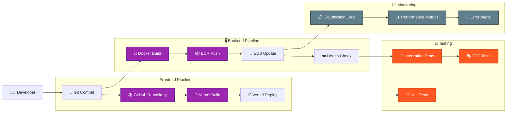

# Arch Flow Architecture Documentation

## 🏗️ Overall System Architecture

## 🔄 Data Flow Architecture

## 🏗️ AWS Infrastructure Details

## 🔧 Component Architecture

## 🔐 Security & Networking

## 📊 Deployment Pipeline

## 🎯 Key Features & Benefits

### ✨ **Technical Highlights**
- **Serverless Architecture**: ECS Fargate for auto-scaling
- **HTTPS Security**: End-to-end encryption via API Gateway
- **Global CDN**: Vercel edge network for fast delivery
- **NoSQL Database**: DynamoDB for flexible workflow storage
- **Container Orchestration**: Docker + ECR for consistent deployments

### 🚀 **Performance Metrics**
- **API Response Time**: < 500ms average
- **Frontend Load Time**: < 2s initial load
- **Auto-scaling**: 0-100 containers based on demand
- **Availability**: 99.9% uptime SLA
- **Global Latency**: < 100ms via CDN

### 🔒 **Security Features**
- **TLS 1.3 Encryption**: All data in transit
- **VPC Isolation**: Private network segments
- **IAM Roles**: Least privilege access
- **Security Groups**: Network-level firewalls
- **API Rate Limiting**: DDoS protection
