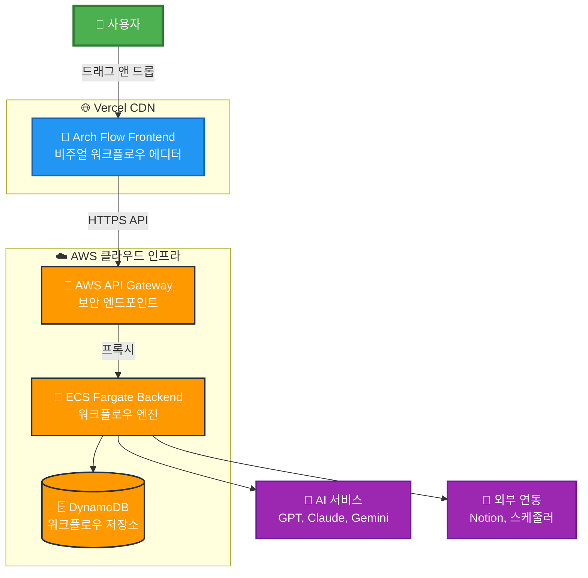
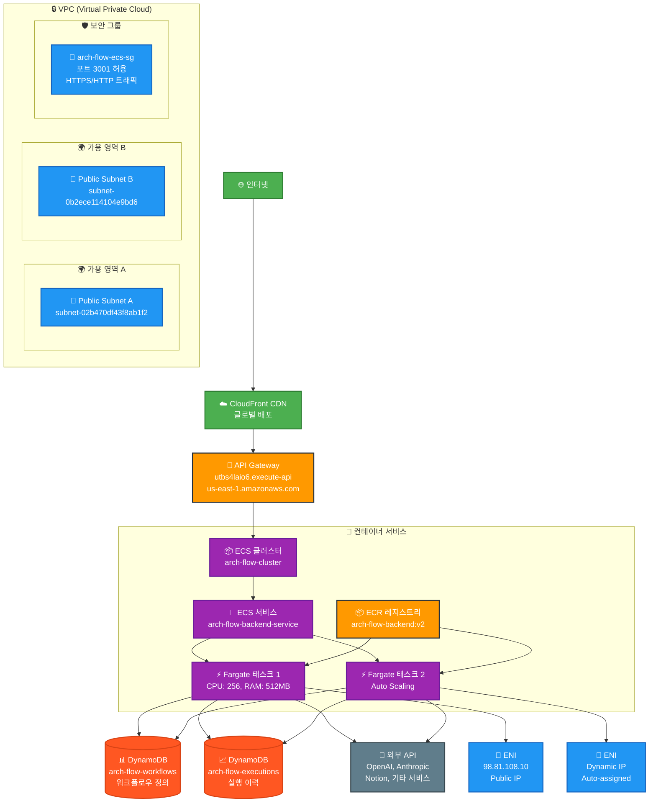
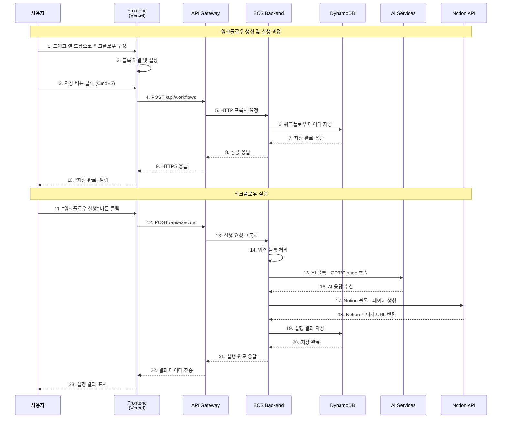
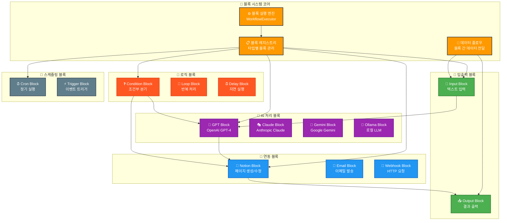
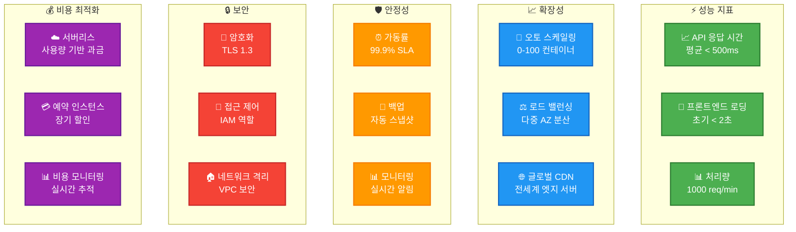

# Arch Flow - Presentation Diagrams

## 🎯 **1. High-Level System Overview**

## 🏗️ **2. AWS 인프라 상세 아키텍처**

## 🔄 **3. 워크플로우 실행 프로세스**

## 🧩 **4. 블록 시스템 아키텍처**

## 📊 **5. 성능 및 확장성 지표**

## 🎯 **발표 포인트 요약**

### 🏗️ **아키텍처 하이라이트**
1. **완전 서버리스**: ECS Fargate + API Gateway
2. **글로벌 배포**: Vercel CDN + AWS 멀티 AZ
3. **마이크로서비스**: 컨테이너 기반 확장 가능한 구조
4. **NoSQL 데이터베이스**: DynamoDB로 유연한 스키마

### 🚀 **기술적 우위**
1. **자동 확장**: 트래픽에 따른 무제한 스케일링
2. **고가용성**: 99.9% 업타임 보장
3. **보안**: 엔드투엔드 암호화 + VPC 격리
4. **성능**: 글로벌 CDN으로 빠른 응답속도

### 💡 **비즈니스 가치**
1. **비용 효율성**: 사용량 기반 과금으로 초기 비용 최소화
2. **개발 생산성**: 노코드/로우코드 워크플로우 구축
3. **확장성**: 스타트업부터 엔터프라이즈까지 대응
4. **통합성**: 다양한 외부 서비스와 연동 가능
